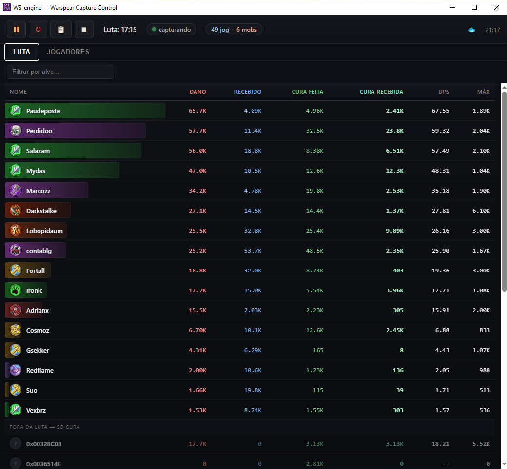

  

<h1 align="center">WS-engine</h1>

  <em>Meter de dano em tempo real para <b>Warspear Online</b> 
  Estilo Details/Recount — mostra quem tá batendo mais, quem tá curando, quem tá na sua área.</em>

  

---

## O que faz

**Aba LUTA** — meter de combate:
- Ranking de dano ao vivo com barra colorida pela classe.
- Colunas: **Dano**, **Recebido**, **Cura total**, **DPS**, **Máx**.
- Icones dos buffs de consumível ativos (poção, pergaminho, comida) ao lado do nome.
- Dano do pet vai automaticamente pra linha do dono.
- Botão **Copiar top** — copia `1- centable 300k\n2- fulano 210k\n...` pra colar no chat.

**Aba JOGADORES** — quem tá na sua área:
- Cards no topo: total, jogadores, invocações (pets), mobs.
- Lista agrupada por guilda com quantidade de membros.
- Nome + ícone da classe pra cada um.
- Buffs de consumível ativos por jogador — passe o mouse pra ver nome + tempo.

**Captura automática:**
- Detecta o Warspear rodando e liga sozinho.
- Fecha o Warspear = para sozinho.
- Botão vermelho pra parar de vez (não religa até você mandar).

## Como instalar

Passo-a-passo em [`SETUP.md`](SETUP.md). Rápido:

1. Instalar [Wireshark](https://www.wireshark.org/download.html) (marca a opção **Npcap** durante a instalação).
2. Reiniciar o PC (o Npcap precisa disso).
3. Baixar o zip da última versão em [**Releases**](https://github.com/antunysOliveira/WS-Meter/releases/latest) e extrair pra qualquer pasta no PC.
4. Abrir o Warspear e logar normal.
5. Duplo-clique em **`WS-engine.exe`** — aceita o UAC (precisa admin pra ler os pacotes).
6. Pronto — o meter começa a preencher quando você entra em combate.

## Requisitos

- Windows 10 (21H1 ou mais novo) / Windows 11
- Wireshark + Npcap
- .NET Framework 4 (já vem no Windows)
- Microsoft Edge WebView2 Runtime (Win 11 já tem; Win 10 pode precisar instalar — o app avisa)
- Warspear rodando como Administrador

## Perguntas frequentes

**É trapaça? Vai me banir?**
Não. O programa **só lê** o tráfego de rede e a memória do jogo — não injeta nada, não modifica pacote, não fala com o servidor. É o mesmo tipo de ferramenta que existe pra WoW (Details) e outros MMOs. Uso por conta e risco.

**Preciso deixar rodando junto?**
Sim. Abre antes de logar OU depois. Se abrir depois, algumas informações (classes de pets, pessoas que entraram antes) podem estar incompletas até a próxima troca de área.

**Não aparece nome/classe de alguém.**
Nomes vêm de várias fontes (chat, placar de instância, memória do jogo). Se alguém não abre a boca e não é do seu grupo, pode demorar. Renomeia manualmente clicando com botão direito na linha.

**Buff aparece mas some depois.**
Buff expira sozinho pelo tempo (poção/comida ~10min, pergaminho ~5min). Cliente só vê o buff **enquanto o jogador está na sua área** — se ele saiu, buff some.

**Números da luta anterior não zeraram.**
Clica no botão **↻ (Nova luta)** — encerra a luta atual, começa nova, zera todos os números. Nomes/classes/pets ficam.

**Meu antivírus/Windows Defender flagou.**
O programa é `.exe` não-assinado que pede admin e lê tráfego de rede — cara de trojan pro AV. Falso positivo. Adiciona exceção pra pasta.

## Créditos & disclaimer

- Feito por diversão / RE educacional.
- **Warspear Online** é marca registrada da **Aigrind LLC** — este projeto não é afiliado nem endossado.
- Use por sua conta e risco.

## Solução de problemas

Ver [`SETUP.md`](SETUP.md) para troubleshoot completo (Npcap, WebView2, permissões, adaptador de rede errado, etc.).
